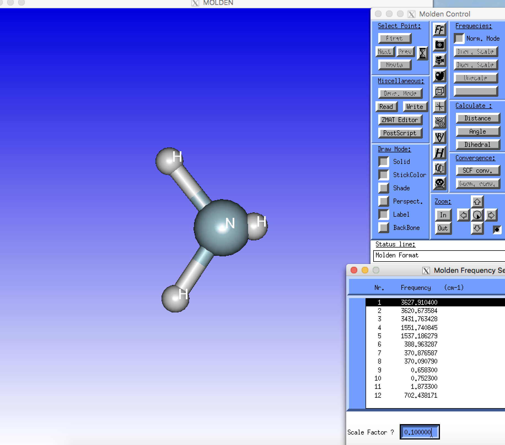
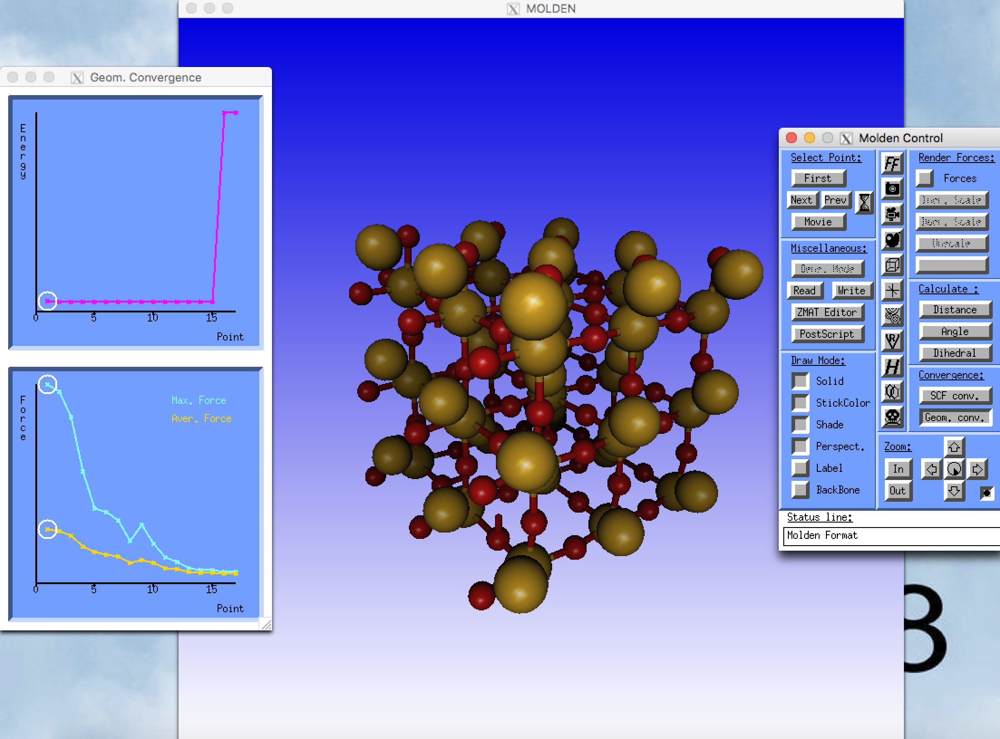

# cgrad

[](https://travis-ci.org/Ionizing/usefultools-for-vasp)

```
An OUTCAR monitor for VASP relaxation calculations.
	Current version is v0.3.0
  Author: Ionizing PeterSmith_9@outlook.com
  Acknoledgement: renh, zqj
  If any issues come up or you have any feature requests, open issues at:
  https://github.com/Ionizing/usefultools-for-vasp/issues I'll appreciate it very much. ^_^

Usage:
  ./cgrad [OPTION...]

      --magmom           Output each ion step's magmom
      --volume           Output each ion step's lattice volume
      --poscar           Save each ion step's atom pos info as POSCAR frames
      --molden           Save each ion step's atom pos info as one molden
                         file
  -e, --without-entropy  Output TOTEN without entropy
      --example          Print an example usage of cgrad
  -h, --help             print help
      --direct           Use direct coordinate rather than Cartesian when
                         saving POSCAR
  -c, --clean-format     Output in clean format without color
      --skip arg         Skip the head steps when saving as molden
  -o, --outcar arg       Specify OUTCAR file
      --prefix arg       Specify POSCAR file prefix when saving as POSCAR
                         frames
      --dir arg          Specify sub-directory in which POSCAR frames saved
      --vibration        Parse vibration modes from OUTCAR and save them as
                         .mol file, IBRION = 5 is required
      --xsf_mode arg     Parse certain vibration mode and save it as .xsf
                         file(s). 0 is treated as saving all the modes
      --xsf_prefix arg   Specify xsf file prefix when saving vibration modes,
                         default: 'mode'
      --xsf_sub_dir arg  Specify sub-directory in which xsf files saved,
                         default: 'vib_modes'
      --xsf_scale arg    Specify scale parameter when saving freq modes into
                         xsfs, if you want to magnify the vector
      --mol_prefix arg   Specify mol file prefix when saving vibration modes,
                         default: 'modes'
```
## Make

`cd` into `grad3` directory and `make`.

`make test` is recommended, if you trust my code, just `make` and skip the test XD;

If `g++` compiler is not found, substitute it with `clang++`, `icpc`, etc.

The result of `make test` shows [here](./grad3/test_result.md)

**Your compiler is required to support `C++11` standard (full of C++11, i.e. gcc ver > 4.9).**

## Acknoledgement
Supervisors: [renh](https://github.com/renh), [zqj](https://github.com/QijingZheng);
Libraries used: [Eigen3](https://eigen.tuxfamily.org), [cxxopts](https://github.com/jarro2783/cxxopts), [Catch2](https://github.com/catchorg/Catch2)

# Some screenshots for third_party visualizers

## Use Molden to view vibration modes



## Use Molden to view the trajectory of optmization


